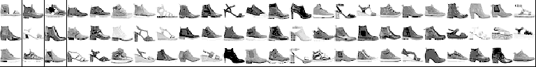
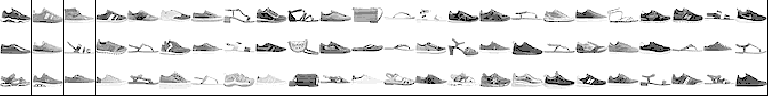

k-means Clustering of Clothing types
================

[Fashion mnist dataset by Zalando Research on Kaggle](https://www.kaggle.com/zalando-research/fashionmnist)

``` r
knitr::opts_chunk$set(cache = TRUE)
set.seed(1)
library(tidyverse)
```

    ## -- Attaching packages --------------------------------------- tidyverse 1.3.1 --

    ## v ggplot2 3.3.5     v purrr   0.3.4
    ## v tibble  3.1.6     v dplyr   1.0.7
    ## v tidyr   1.1.4     v stringr 1.4.0
    ## v readr   2.1.1     v forcats 0.5.1

    ## -- Conflicts ------------------------------------------ tidyverse_conflicts() --
    ## x dplyr::filter() masks stats::filter()
    ## x dplyr::lag()    masks stats::lag()

``` r
library(GGally)
```

    ## Registered S3 method overwritten by 'GGally':
    ##   method from   
    ##   +.gg   ggplot2

``` r
train <- read.csv('./fashion-mnist_train.csv')
label <- train[1]
images <- as.matrix(train[-1])/255
remove(train)
```

``` r
label_map <- data.frame(
  label = 0:9,
  group = c(
    'T-shirt/top',
    'Trouser',
    'Pullover',
    'Dress',
    'Coat',
    'Sandal',
    'Shirt',
    'Sneaker',
    'Bag',
    'Ankle boot'),
  group2 = c(
    'top',
    'bottom',
    'top',
    'top',
    'top',
    'shoe',
    'top',
    'shoe',
    'bag',
    'shoe')
)
```

``` r
print_img <- function(n, data = images, asp = 1) {
  for (i in n) {
    image(matrix(data[i,ncol(data):1], nrow = 28),
          col = gray.colors(10, 1, 0), asp = asp,
          xaxt = "n", yaxt = "n")
  }
}

ratio <- 5*c(2,8)
par(mfrow = ratio, mar = rep(0, 4))
N <- dim(images)[1]
print_img(sample(1:N, prod(ratio)))
```

<!-- -->

A reasonable goal would be to cluster this into at least 4 groups. Which
could ideally be shoes, tops, bottoms, and bags.

``` r
centers <- 10
kmeans <- kmeans(images, centers, 100000)
```

``` r
ratio <- 3*c(1, 8)
par(mfrow = ratio, mar = rep(0, 4))

index <- 1:N
for (n in 1:centers) {
  print(paste('cluster',n))
  print_img(sample(index[kmeans$cluster == n],prod(ratio)))
}
```

    ## [1] "cluster 1"

<!-- -->

    ## [1] "cluster 2"

<!-- -->

    ## [1] "cluster 3"

<!-- -->

    ## [1] "cluster 4"

<!-- -->

    ## [1] "cluster 5"

<!-- -->

    ## [1] "cluster 6"

<!-- -->

    ## [1] "cluster 7"

<!-- -->

    ## [1] "cluster 8"

<!-- -->

    ## [1] "cluster 9"

<!-- -->

    ## [1] "cluster 10"

<!-- -->

``` r
results <- data.frame(index = 1:N, cluster = kmeans$cluster, label = label) %>% 
  left_join(label_map)
```

    ## Joining, by = "label"

``` r
results %>% 
  ggplot(aes(cluster, fill = group)) +
    geom_bar(position="stack")
```

<!-- -->

``` r
results %>% 
  ggplot(aes(cluster, fill = group2)) +
    geom_bar(position="stack")
```

<!-- -->

There is still too much clustering based on brightness. To get any good
separation based on item type, it needs around 10-20 clusters. Then
there are multiple clusters for 1 type but in different shades.

Trying to normalize doesn’t have the desired effect on darkness.

``` r
images_normal <- wordspace::normalize.rows(images)
ratio <- 5*c(3,5)
par(mfrow = ratio, mar = rep(0, 4))
print_img(sample(1:N, prod(ratio)), images_normal)
```

<!-- -->

The outline could also be used to identify item type. I will try once
with just the outline and another with both.

``` r
outline <- matrix(as.numeric(images > 0), nrow = N)
images_outline <- cbind(images, outline)
ratio <- 4*c(1.5,5)
par(mfrow = ratio, mar = rep(0, 4))
print_img(sample(1:N, prod(ratio)), images_outline, 2)
```

<!-- -->

``` r
centers <- 10
kmeans_justoutline <- kmeans(outline, centers, 100000)
kmeans_both <- kmeans(images_outline, centers, 100000)
```

Just outline

``` r
ratio <- 3*c(1, 8)
par(mfrow = ratio, mar = rep(0, 4))

index <- 1:N
for (n in 1:centers) {
  print(paste('cluster',n))
  print_img(sample(index[kmeans_justoutline$cluster == n],prod(ratio)))
}
```

    ## [1] "cluster 1"

<!-- -->

    ## [1] "cluster 2"

<!-- -->

    ## [1] "cluster 3"

<!-- -->

    ## [1] "cluster 4"

<!-- -->

    ## [1] "cluster 5"

<!-- -->

    ## [1] "cluster 6"

<!-- -->

    ## [1] "cluster 7"

<!-- -->

    ## [1] "cluster 8"

<!-- -->

    ## [1] "cluster 9"

<!-- -->

    ## [1] "cluster 10"

<!-- -->

``` r
results_outline <- data.frame(index = 1:N, cluster = kmeans_justoutline$cluster, label = label) %>% 
  left_join(label_map)
```

    ## Joining, by = "label"

``` r
results_outline %>% 
  ggplot(aes(cluster, fill = group)) +
    geom_bar(position="stack") + 
    labs(title = 'Clustering with just the outline')
```

<!-- -->

``` r
results_outline %>% 
  ggplot(aes(cluster, fill = group2)) +
    geom_bar(position="stack") + 
    labs(title = 'Clustering with just the outline')
```

<!-- -->

Outline and picture

``` r
par(mfrow = ratio, mar = rep(0, 4))
for (n in 1:centers) {
  print(paste('cluster',n))
  print_img(sample(index[kmeans_both$cluster == n],prod(ratio)))
}
```

    ## [1] "cluster 1"

<!-- -->

    ## [1] "cluster 2"

<!-- -->

    ## [1] "cluster 3"

<!-- -->

    ## [1] "cluster 4"

<!-- -->

    ## [1] "cluster 5"

<!-- -->

    ## [1] "cluster 6"

<!-- -->

    ## [1] "cluster 7"

<!-- -->

    ## [1] "cluster 8"

<!-- -->

    ## [1] "cluster 9"

<!-- -->

    ## [1] "cluster 10"

<!-- -->

``` r
results_both <- data.frame(index = 1:N, cluster = kmeans_both$cluster, label = label) %>% 
  left_join(label_map)
```

    ## Joining, by = "label"

``` r
results_both %>% 
  ggplot(aes(cluster, fill = group)) +
    geom_bar(position="stack") + 
    labs(title = 'Clustering with image and outline')
```

<!-- -->

``` r
results_both %>% 
  ggplot(aes(cluster, fill = group2)) +
    geom_bar(position="stack") + 
    labs(title = 'Clustering with image and outline')
```

<!-- -->

The outline did surprisingly with the larger categories here.
